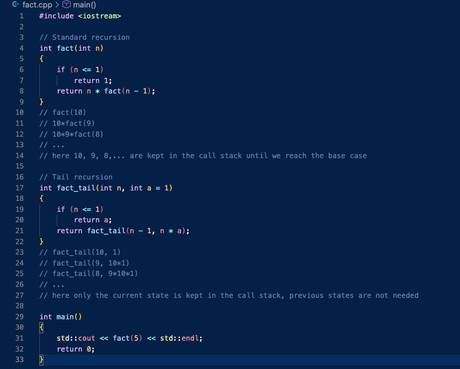
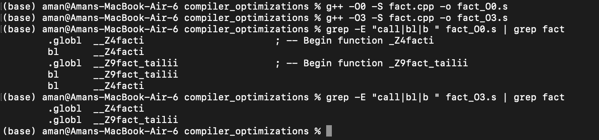

# Different types of compiler optimizations
1. A lot of things compiler can do for us to make the code faste:
    - loop unrolling, splitting, fusion
    - reordering instructions
    - precomputing values
    - branch prediction hints
    - inlining functions
    - dead code elimination
    - constant propagation
    - vectorization and so on!
2. Some optimizations don't work well with volatile variables (variables which can be changed by hardware, like in embedded systems where a sensor is linked to a memory address). Hence "volatile" forces the CPU to fetch the variable from memory every time it is being used, to push away the arrogant compiler optimizations.
    ```cpp
    int some_int = 100;
    while(some_int == 100) // The compiler sees this loop & makes it while(true)
    {
       // Code that does NOT change 'some_int'
    }
    ```
    - The compiler might optimize this to an infinite loop, since it sees that 'some_int' is never changed in the loop.
    - To prevent this, we can declare 'some_int' as volatile, as it might be changed by some external hardware.
3. Downside of compiler optimizations is that they can mess up debugging, as the optimized code may not correspond directly to the source code. Using gdb with optimizations can overlook errors.
1. Tail call optimization: When we have something like a recursive funciton, when we need it's other operands in the memory as well which keeps on increasing the stack size. But if we pass the result of the function directly when we won't be needed more stack frames, hence it would just be a loop. Example: in this code I ran a fact(5) with -o0 and -o3 optimizations
    <p align="center">
      
    </p>
    <p align="center">
      
    </p>

    - bl stands for Branch with Link
    - It saves the return address to the link register and jumps to the function.
    - In the optimized version, it replaced the recursive "call" with a simple jump (or a loop) back to the top of the function, hence we can now calulate factorials of large numbers without stack overflow.
    - Tail Recursion is the "proper" way to write, so that we dont depend on compiler to be clever enough 