# Performance Todo List
1. No unnecessary computations:
    - No unnecessary copying
    - No unnecessary allocations
2. Use all computing power:
    - Use all cores
    - Use SIMD
3. Avoid waits and stalls:
    - Lockless data structures
    - Asynchronous APIs
    - Job systems
4. Use hardware efficiently:
    - Cache friendly data structures
    - Well predictable branches
    - Avoid false sharing
5. OS-level efficiency
---
<p align="center">
  
</p>

(The below are possible ways to increase the performance of a pipeline but these should be tested in an development enviroment and be merged only after thorough benchmarking and profiling)

## Build Pipeline Modifications
1. Enable compiler optimizations: doesn't require touching the C++ code
    - <p align="center">
      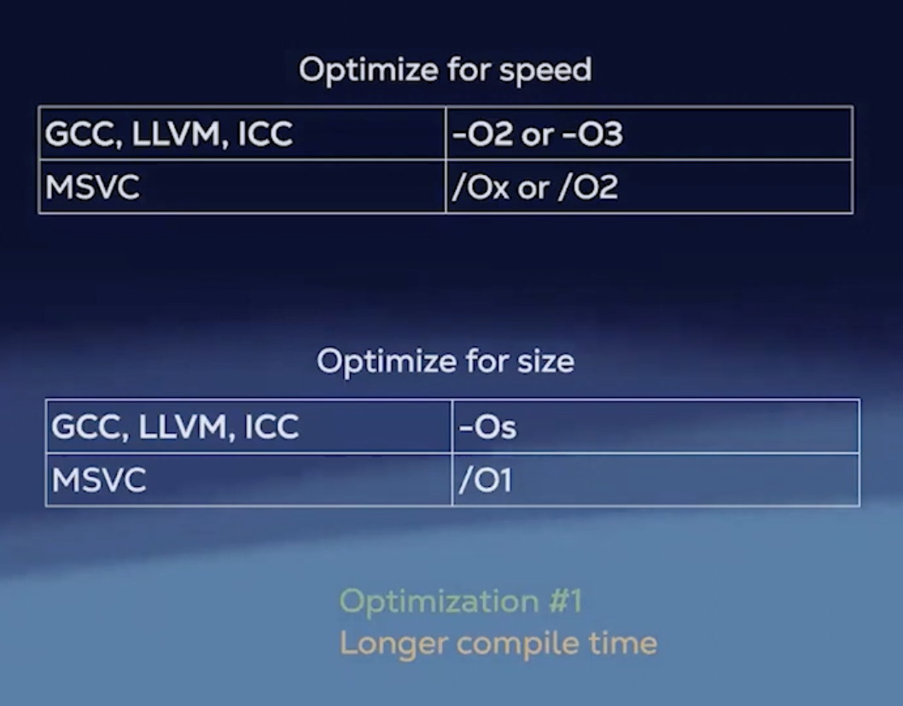
      </p>
    - <span style="color: #00CC00;">Optimization #1: Longer compile times, smaller binaries, faster execution</span>
2. Set target architecture:
    - Tells the compiler to perform micro-optimizations for a specific CPU architecture
    - Also tells the compiler which SIMD instruction sets to use (e.g., SSE, AVX)
    - <p align="center">
      
      </p>
3. Use fast math:
    - GCC, LLVM: `-ffast-math` (included in `-Ofast`)
    - MSVC: `/fp:fast`
    - ICC: `-fp-model=fast`
    - <span style="color: #00CC00;">Faster computations by allowing reordering and approximations of floating-point operations</span>
    - <span style="color: #FF4444;">Less precise results, non standard compliant</span>
4. Disable exceptions and RTTI if not used:
    - No exceptions
        - GCC, LLVM, ICC: `-fno-exceptions`
        - MSVC: `/EHs-c- /D_HAS_EXCEPTIONS=0`
    - No RTTI:
        - GCC, LLVM, ICC: `-fno-rtti`
        - MSVC: `/GR-`
    - <span style="color: #FFB300;">Reduces binary size and improves performance by removing exception handling and RTTI overhead (not major performance gains)</span>
    - <span style="color: #FF8800;">Breaks code using exceptions and RTTI and non standard compliant</span>
5. Enable Link Time Optimization (LTO):
    - As the compiler doesn't have the full picture of the program during individual translation unit compilation, LTO allows optimizations across all translation units at link time, as the linker has the big picture of the entire program.
    - This enables more aggressive inlining, dead code elimination, and other cross-module optimizations
    <p align="center">
      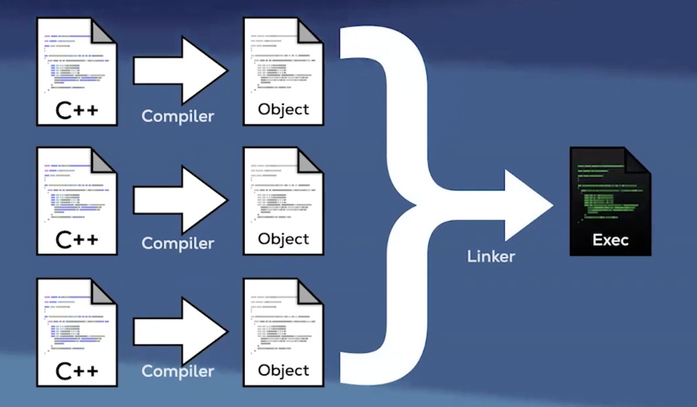
    </p>
    - GCC, LLVM: `-flto`
    - MSVC: `/GL`
    - ICC: `-ipo`
    - <span style="color: #00CC00;">Allows the compiler to optimize across translation units, leading to better inlining and dead code elimination</span>
    - <span style="color: #FF4444;">Increases compile time and memory usage during compilation</span>
6. Use unity builds: (substitute to LTO)
    - <p align="center">
      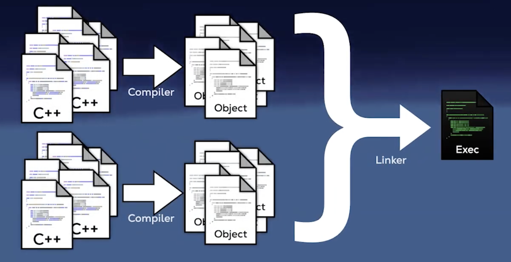
      </p>
    - Combines multiple source files into a single compilation unit, reducing overhead and enabling better optimization
    - Reduces the total number of source files the compiler has to process, leading to faster build times
    - Harder, as  macros are split b/w files
    - Cmake: `-DCMAKE_UNITY_BUILD=ON`
7. Link statically:
    - <p align="center">
      
      </p>
    - static linking can improve performance by reducing runtime overhead associated with dynamic linking, such as symbol resolution and relocation
    - However, static linking increases the size of the executable, as all library code is included directly in the binary
    - Trade-off between performance and binary size
    - GCC, LLVM: `-static`
    - MSVC: `/MT` (for static runtime linking)
8. Use profile-guided optimization (PGO):
    - <p align="center">
      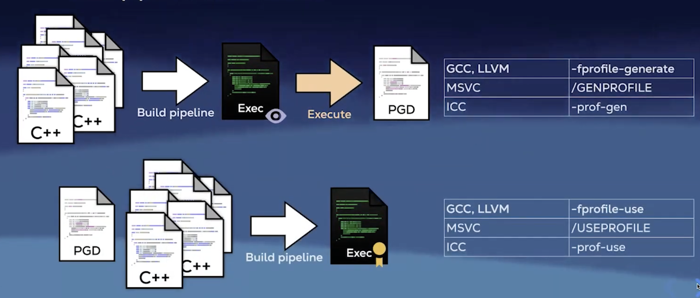
      </p>
    - Involves compiling the program with various performance counters embedded into it to collect runtime data, running the program to get a special file togather profiling information, and then recompiling using this data to guide optimizations
    - Next time the program is compiled with the PGD
    - Helps the compiler make informed decisions about inlining, loop unrolling, and branch prediction based on actual usage patterns
    - <span style="color: #00CC00;">Optimizes the code based on real-world usage patterns, rather than heuristics, leading to better performance</span>
    - <span style="color: #FF4444;">Requires multiple compilation steps and profiling runs</span>
    - https://en.wikipedia.org/wiki/Profile-guided_optimization
    - https://developer.android.com/games/agde/pgo-overview
9. Try different compilers
10. Try different standard library implementations:
    - Different standard library implementations may have varying performance characteristics for certain operations
    - For example, `libc++` (LLVM) vs `libstdc++` (GCC)
    - Benchmark your specific use cases to see which implementation performs better
11. Preload with a replacement lib:
    - Speeds up memory allocations by using a high-performance memory allocator like `tcmalloc`, `jemalloc`, or `mimalloc` instead of the default system allocator
    - Linux, BSD: env LD_PRELOAD=/usr/lib/libSUPERmalloc.so ./your_application
    - macOS: env DYLD_INSERT_LIBRARIES=/usr/lib/libSUPERmalloc.dylib ./your_application
    - Windows: Requires DLL injection techniques to replace the default allocator with a custom one
12. Use binary post processing tools:
    - <p align="center">
      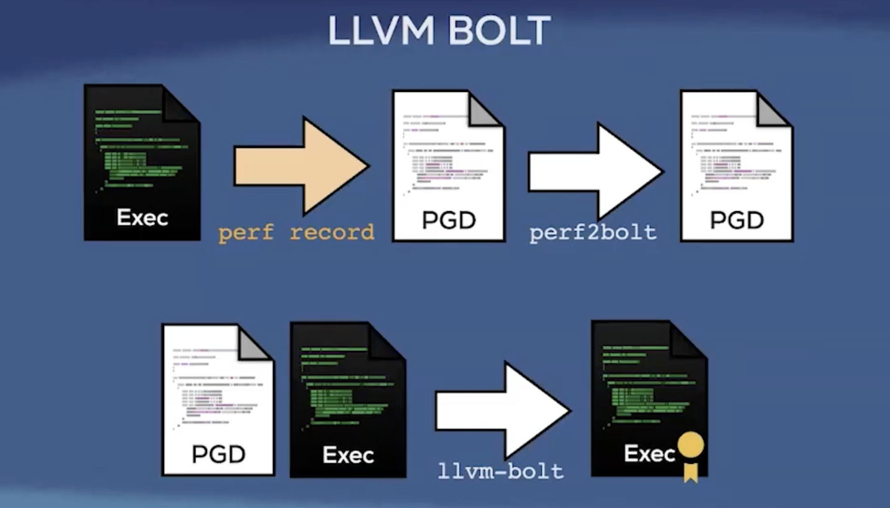
      </p>
    - Tools like `LLVM BOLT` and `Google's PatchELF` can optimize the final binary by reordering functions and data based on runtime profiling information
    - This can improve instruction cache utilization and reduce page faults, leading to better runtime performance
----
## Effective use of C++
1. Constexpr all the things:
    - <p align="center">
      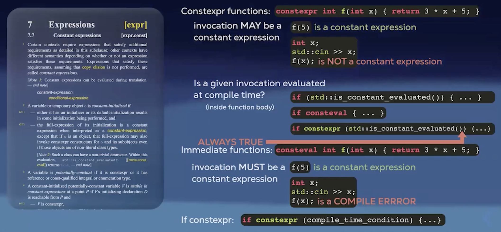
    </p>
    - <p align="center">
      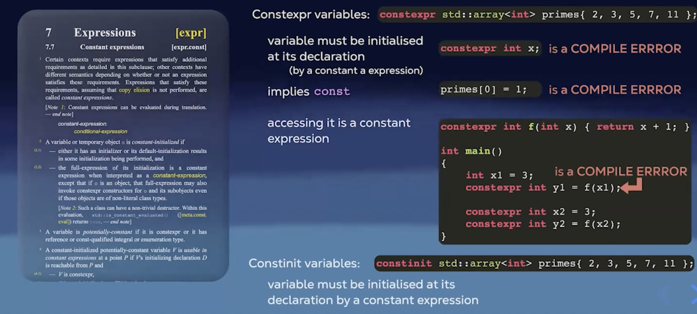
    </p>
    - Read more: what are constexpr, rules and best practices
    - https://stackoverflow.com/questions/14116003/whats-the-difference-between-constexpr-and-const
    - https://medium.com/@sofiasondh/c-const-vs-constexpr-the-comparison-183f9dd92deb
2. Make varibales const:
    - See if const can be used, there are muliple ways to tell a variable is const
    - Make member functions const if they don't modify the object state
    - Explicit object parameters (C++23)
    - Global variables: copy globals to const locals (if copying is cheap) at the start of functions to help the compiler optimize access
    <p align="center">
      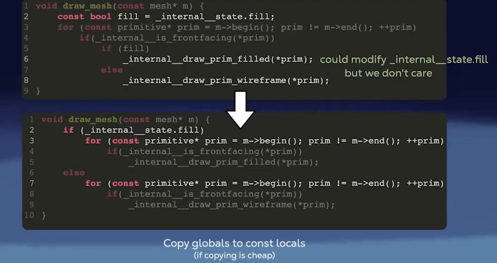
    </p>
3. Noexcept all the things:
    - void f(); -> could throw exceptions
    - void f() noexcept; -> will not throw exceptions
    - <p align="center">
      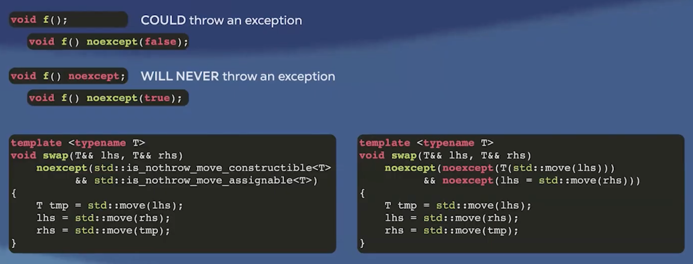
    </p>
4. Use static for internal linkage:
    - static variables, static member functions
    - Can be also used to mark internal linkage variables & functions
    - static int global_values;
    - static void helper_function();
    - <p align="center">
      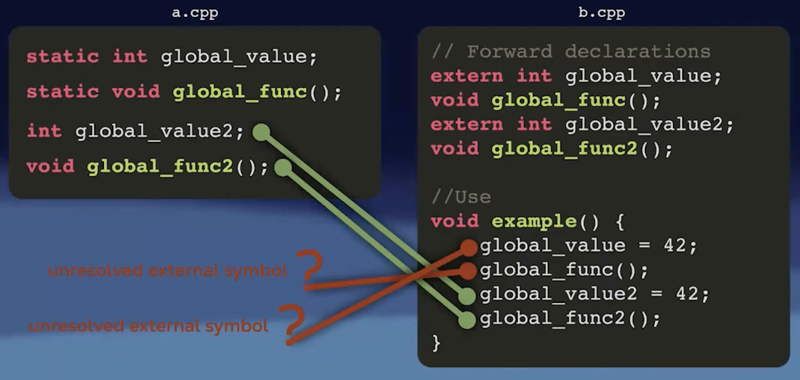
    </p>
    - inline is a weak hint to the compiler to inline the function, but static gives internal linkage
    - <p align="center">
      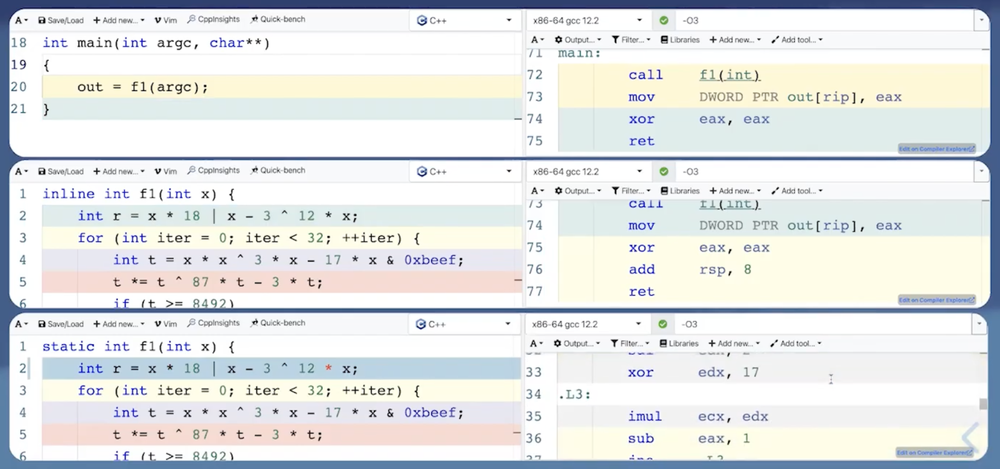
    </p>
    - above f1 does random arithematic which doesnn't make sense, the machine code of it is so long that the compiler decides not to inline it, but f1 is only called once, but doesn't matter how big the function is its worth inilining it as its only called once, hence static forces the compiler to inline it.
5. Use [[noreturn]]
    - use to mark a function that does not return to the caller, example error throwing functions or functions that terminate the program
    - helps the compiler optimize control flow and eliminate dead code paths
6. Use [[likely]] and [[unlikely]]:
    - Hints to the compiler about the expected outcome of a condition
    - Helps the compiler optimize branch prediction and instruction layout
    - Example:
        ```cpp
        if ([[likely]] condition) {
            // code for the likely case
        } else {
            // code for the unlikely case
        }
        ```
    - <p align="center">
      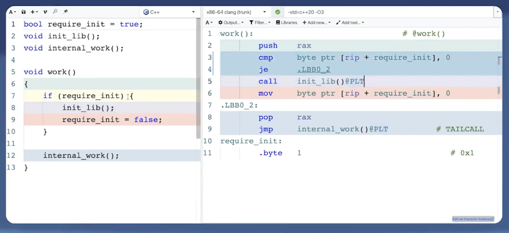
    </p>
    - <p align="center">
      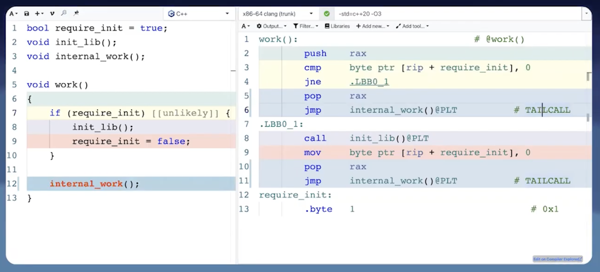
    </p>
    - Note: Use these attributes judiciously, as incorrect hints can lead to worse performance
7. Use [[assume(condition)]]:
    - <p align="center">
      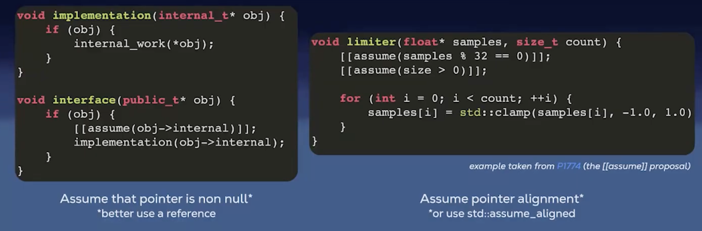
    </p>
    - assert(condition) is for the programmer, assume is for the compiler
    - if !condition is false, the behavior is undefined
    - declare a code path as unreachable to help the compiler optimize (or use std::unreachable in C++23)
8. Make functions pure:
    - <p align="center">
      
    </p>
    - A pure function is a function where the return value is determined only by its input values, without observable side effects (also can be used const)
9. Take parameters properly:
    - <p align="center">
      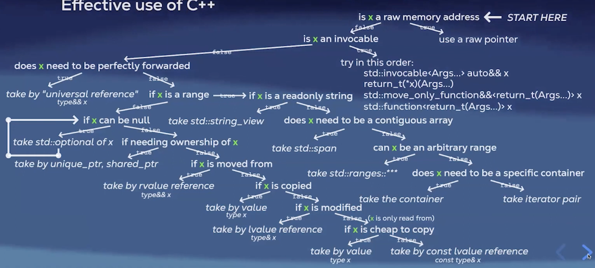
    </p>
10. Avoid allocations in loops:
    - Hoist their declatarations outside the loop, allocated memory can be preserved b/w loops, object needs to be cleared if needed using .clear()
    - Reserve space in containers if size is known beforehand, vector can have more space than needed
    - <p align="center">
      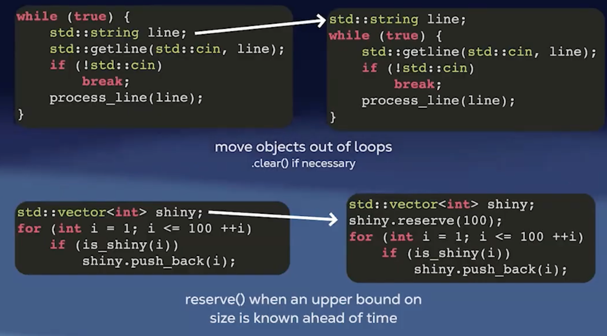
    </p>
11. Avoid copying exceptions:
    - avoids slicing if their dynamic type is derived from the static type
    - <p align="center">
      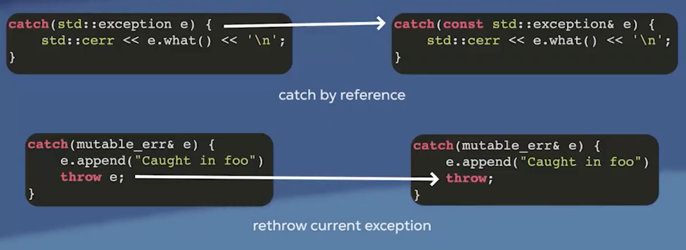
    </p>
12. Avoid copies for in range-for & lambda captures & st. bindings:
    - use references in range-for loops to avoid unnecessary copies
    - <p align="center">
      
    </p>
    - <p align="center">
      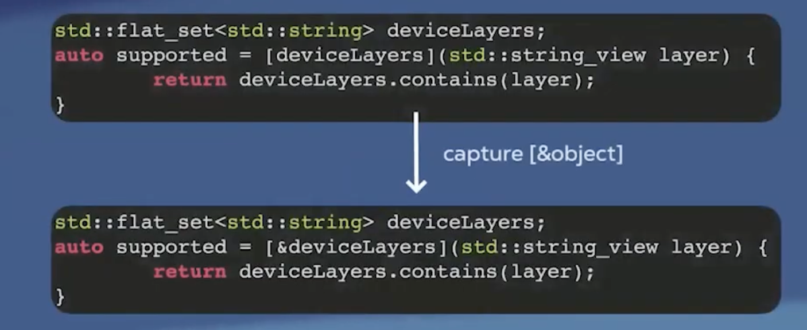
    </p>
    - <p align="center">
      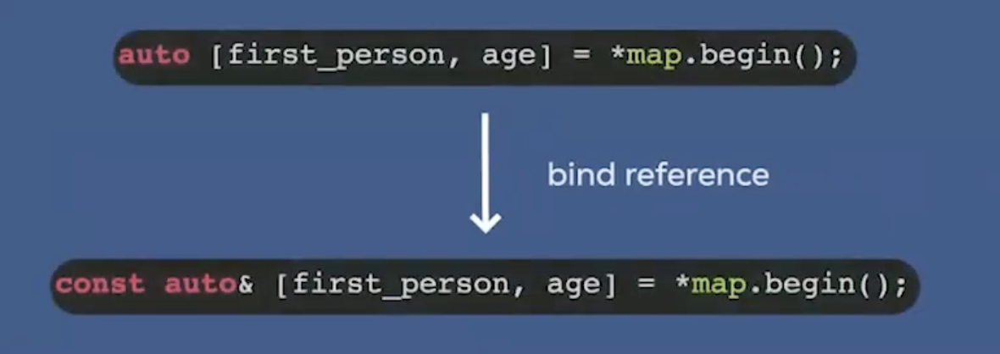
    </p>
---
## Manual hardware oriented optimizations
1. Memory mental model:
    - Byte sized chunks in the form of a tape? No, we have multiple levels of caches (L1, L2, L3) b/w CPU and RAM
    - <p align="center">
      
    </p>
    - Prefetching: cache lines, data locality
    - Caching: small memory close to the CPU, faster access times, temporal locality (Recently accessed data is likely to be accessed again soon)
    - <p align="center">
      
    </p>
2. Takeaways from the above:
    - Access memory sequentially to take advantage of spatial locality
    - Keep frequently accessed data in cache to benefit from temporal locality
    - Minimize cache misses by optimizing data structures and access patterns
    - std::array, std::vector, std:deque, std::flat_map, std::flat_set are cache friendly
    - std::list, std::set, std::unordered_map, std::unordered_set, std::map are not cache friendly
    - row-major > column-major order
    - reordering struct members to minimize padding and improve cache line utilization
    <p align="center">
      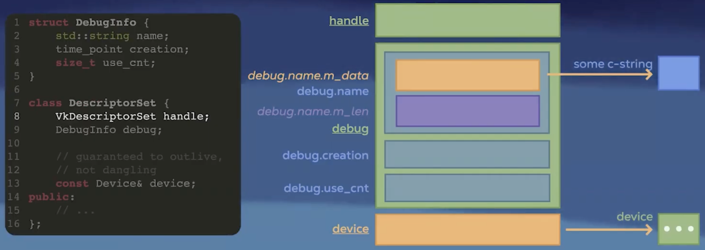
    </p>
    <p align="center">
      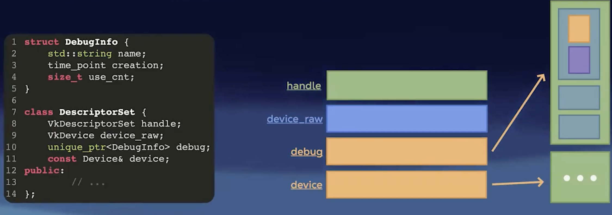
    </p>
    - some other ways to be temporaily local:
        - loop fusion
        - blocking (tiling)
        - AoS vs SoA
        - thread affinity
        (Pin thread to a core)
        - Linux: pthread_setaffinity
        - Windows: SetThreadAffinityMask
        - macOS: thread_policy_set with thread_affinity_policy_t
        - we can also set priority of the process and priority of the thread
        - NUMA architecture awareness
3. Branch predictor:
    - avoid indirect calls
    - make branches predictable
    - use branchless operations where possible (cmov -> assembly level, ternary operator, bitwise operations)
4. SIMD:
    - Use compiler auto-vectorization
    - Use SIMD intrinsics for critical code paths
    - Use libraries that leverage SIMD (e.g., Eigen, Intel IPP)
---
