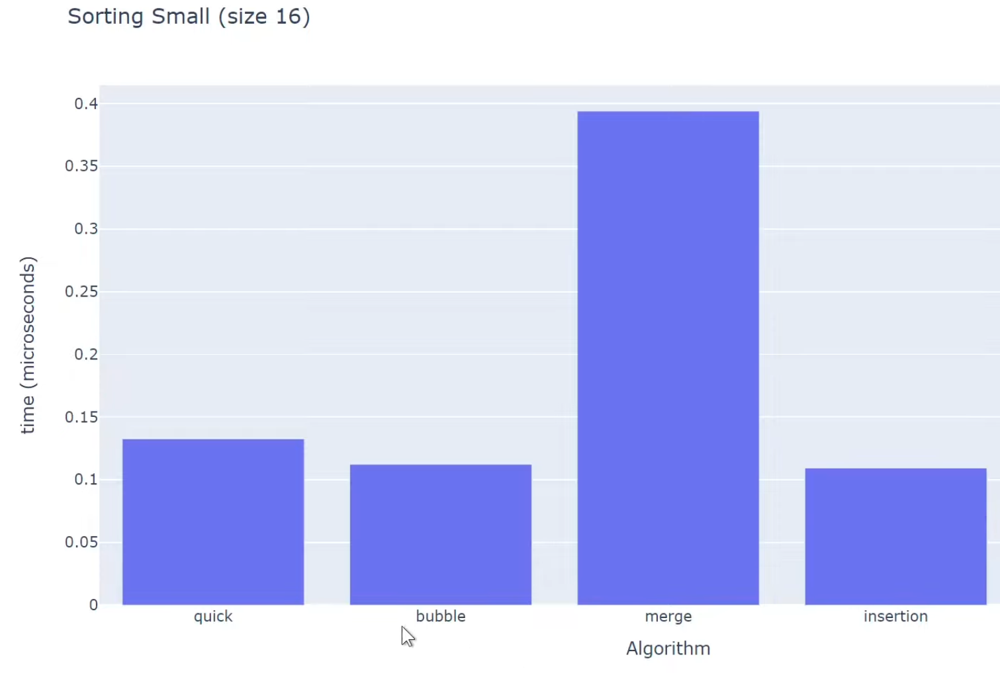
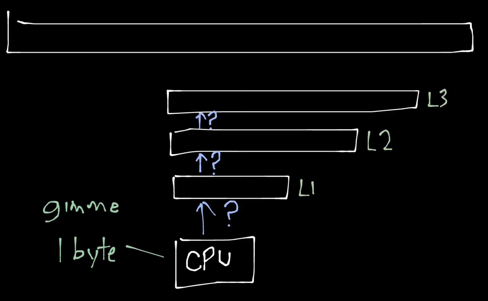
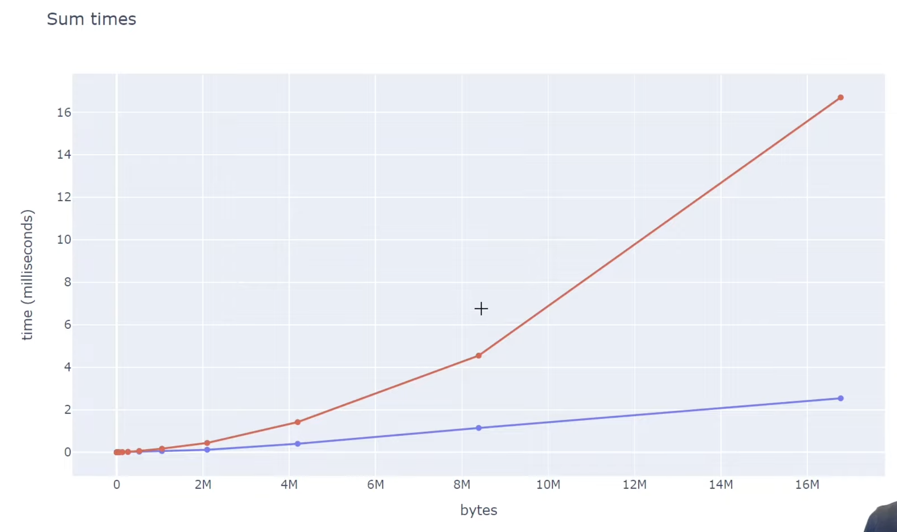
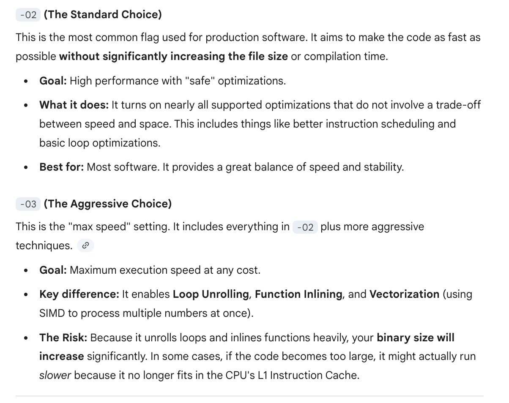
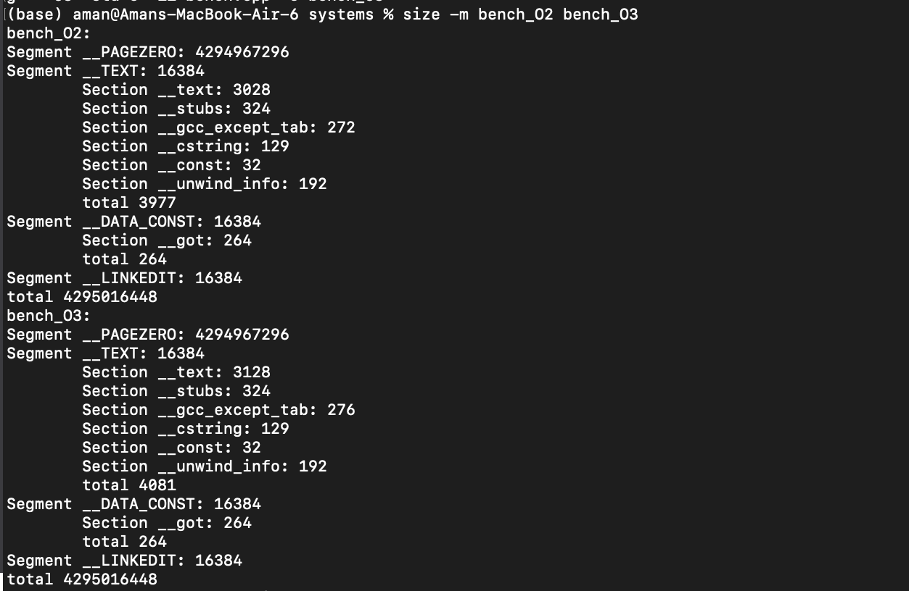
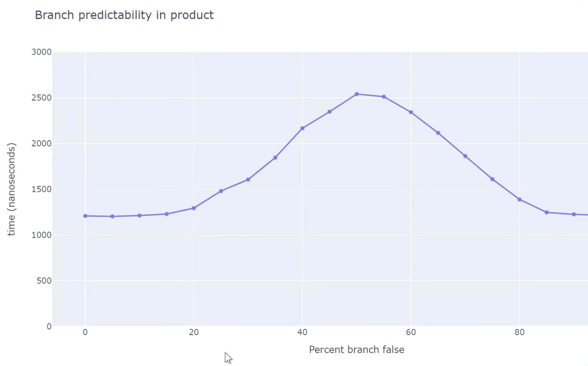

# Cache Locality and Branch Predictions
1. For smaller N, N^2 algorithm performs faster than NlogN algorithms , quick sort and merge sort are both NlogN algorithms but they perform worse, std::sort performs the best. Cache locality and branch predictability are more important factors.

<p align="center">
  
</p>

2. [How to check cache size?](https://medium.com/cemac/obtaining-cpu-cache-size-bafd9607e61a), On my Mac I have: L1I=128kb, L1D=64kb and L2=4MB (per core), Cache line size = 128B 
    - Cache line is the smallest chunk of memory moved between RAM and CPU cache. When you load one byte, the CPU actually loads the entire cache line. x86: usually 64 bytes, in my MAC (M2): 128 bytes
    - CPUs don’t load variables, they load cache lines. Nearby data is “free” once a cache line is loaded. This is called spatial locality, why it matters? Good layouts: 
        - arrays of structs (AoS) for sequential access
        - tight structs that fit in one cache line
    - Usually it goes on checking L1 cache first, then L2, then L3, then RAM. Each level is larger but slower.
    <p align="center">
      
    </p>
    - There is soeme prefetching logic in modern CPUs that tries to predict what data will be needed next and loads it into cache ahead of time, based on access patterns. This depends vendor to vendor  (prefetcher live b/w CPU and cache)

3. How the CPU Cache Works (Spatial Locality)

    - This example demonstrates why the layout of the data structures that matters for performance.
    - Example1:
        ```cpp
        struct S {
            int x; // 4 bytes
            int y; // 4 bytes
        };

        void what_is_cache(S s) {
            auto x = s.x; // Accessing x
            auto y = s.y; // Accessing y
        }
        ```
    - auto x = s.x; * Result: Cache Miss (First load). The CPU fetches the entire cache line containing s from RAM. This line now contains both x and y.
    - auto y = s.y; * Result: Cache Hit (Already in cache). Since y was pulled in during the first fetch, the CPU reads it directly from the high-speed cache.
    - Example2:
        ```cpp
        auto get_sum(auto const &vec, auto const &indices) {
            int sum = 0;
            for (auto idx : indices) {
                sum += vec[idx]; // Accessing elements based on indices
            }
            return sum;
        }
        ```
    - If indices are sequential (0,1,2,3...), we get many cache hits because accessing vec[idx] pulls in contiguous cache lines.
    - If indices are random (3, 1000, 42...), we get many cache misses because each access likely pulls in a new cache line from RAM.
        <p align="center">
          
        </p>
        - The kinks are the cache sizes, in the above system L3 cache size is 8MB, so once the working set exceeds that size, cache misses increase significantly. But for inorder acess, spatial locality helps a lot. And after 8MB it didn't matter due to "cache prefeching", which loads data into cache before it's actually needed based on access patterns.
    - Example3: Matrix Multiplication:
        ```cpp
        void matmul_row_major_ijk(auto const &A, auto const &B, auto &C, int N) {
            std::fill(C.begin(), C.end(), 0);
            for (int i = 0; i < N; i++) {
                for (int j = 0; j < N; j++) {
                    // i, j fixed, k varies
                    for (int k = 0; k < N; k++) {
                        C[i*N + j] += A[i*N + k] * B[k*N + j]; // (not changing) += (changing but one element at a time) * (jump k elements, hence bad for cache locality)
                    }
                }
            }
        }
        ```
    - If instead of ijk we loop, ikj or jik, we get better cache performance because we access contiguous memory locations more frequently. As C[i*N + j] is changing only once per i,j, A[i*N + k] is changing contiguously for k, and B[k*N + j] is changing but 1 element at a time, so better cache locality.

4. AoS vs SoA (Cache Efficiency in Loops):
    - When we need to access all elements then AoS is fine but when we need to access only a few fields of a large collection of structs, SoA is much better. 
    - When processing large collections of data, how you organize your memory determines whether your CPU spends its time calculating or waiting for RAM.
    - ### Array of Structs (AoS):
        ```cpp
        struct Particle {
            float x, y, z;
            float velocity;
        };
        Particle particles[1000]; // Array of Structs
        for (int i = 0; i < 1000; i++) {
            particles[i].velocity += 1.0f; // Updating only 'velocity'
        }
        ```
    - In AoS, each `Particle` is 16 bytes. A 64-byte cache line loads 4 structs, but only `velocity` is needed. The other 12 bytes (x, y, z) are wasted, leading to inefficient cache usage.
    - ### Struct of Arrays (SoA):
        ```cpp
        struct Particles {
            float x[1000];
            float y[1000];
            float z[1000];
            float velocity[1000];
        };
        Particles particles; // Struct of Arrays
        for (int i = 0; i < 1000; i++) {
            particles.velocity[i] += 1.0f; // Updating only 'velocity'
        }
        ```
    - In SoA, `velocity` is contiguous. Each cache line loads multiple relevant values, maximizing  utilization. This minimizes memory bandwidth waste, making SoA significantly faster for field-specific updates.
5. Branch Prediction:
    - Modern CPUs use branch prediction to guess the outcome of conditional operations (like if-else statements) before they are executed. If the CPU guesses correctly, it can continue executing instructions without interruption. However, if it guesses incorrectly, it must discard the speculative work and start over, which can lead to performance penalties.
    - Example:
        ```cpp
        for (int i = 0; i < 1000000; i++) {
            if (i % 2 == 0) {
                // Do something for even numbers
            } else {
                // Do something for odd numbers
            }
        }
        ```
    - In this loop, the branch predictor may struggle because the outcome alternates every iteration. This can lead to mispredictions and performance hits.
    - To improve branch predictability, you can restructure your code to minimize unpredictable branches or use techniques like loop unrolling.
    - Loop Unrolling Example:
        ```cpp
        for (int i = 0; i < 1000000; i += 4) {
            // Handle 4 iterations at a time
            if (i % 2 == 0) { /* even */ } else { /* odd */ }
            if ((i + 1) % 2 == 0) { /* even */ } else { /* odd */ }
            if ((i + 2) % 2 == 0) { /* even */ } else { /* odd */ }
            if ((i + 3) % 2 == 0) { /* even */ } else { /* odd */ }
        }
        ```
    - By processing multiple iterations in a single loop iteration, you can reduce the number of branches the CPU needs to predict, improving overall performance. Why loop unrolling works? https://en.algorithmica.org/hpc/architecture/loops/ (Hint: go via the number of useful associated instructions being instructed per loop iteration we can go from 25% to 4/7 = 53% efficienct loops)
    - In modern development, compilers (GCC/Clang/MSVC) usually unroll loops for you automatically if you use -O2 or -O3 flags (also new gen compilers are smart enough to do many trivial branch predictions like predicitng True False True False patterns etc), -O2 and -O3 are "optimization presets."
    - My exploration with O2 vs O3:
        <p align="center">
          
        </p>
        <p align="center">
          
        </p>
        - I wrote a simple C++ matrix multiplication [code](../assets/bench.cpp) and compiled it using -o2 & -o3 optimization flags. As you can see, o3 generates a larger binary (due to unrolling and inlining) but achieves better performance due to reduced branching and improved instruction-level parallelism.
    - Another example: 
        ```cpp
        for (int i = 0; i < N; i++) {
            if (array[i] > threshold) {
                process_high(array[i]);
            } else {
                process_low(array[i]);
            }
        }
        ```
    - If the data in `array` is random, the branch predictor will struggle, leading to frequent mispredictions and performance degradation.
    <p align="center">
      
    </p>