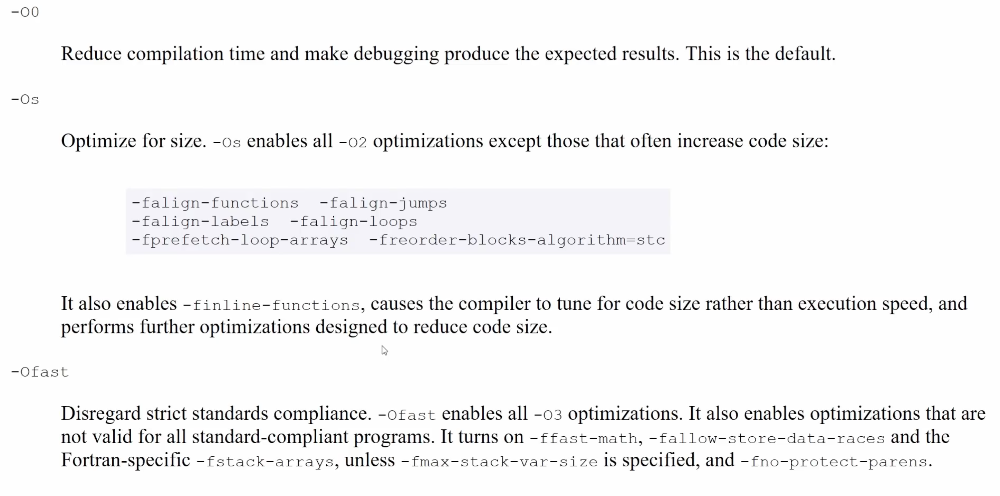
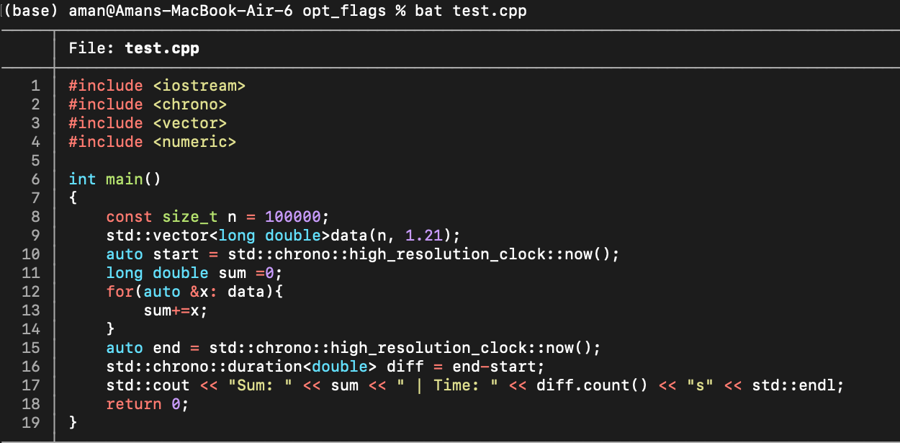
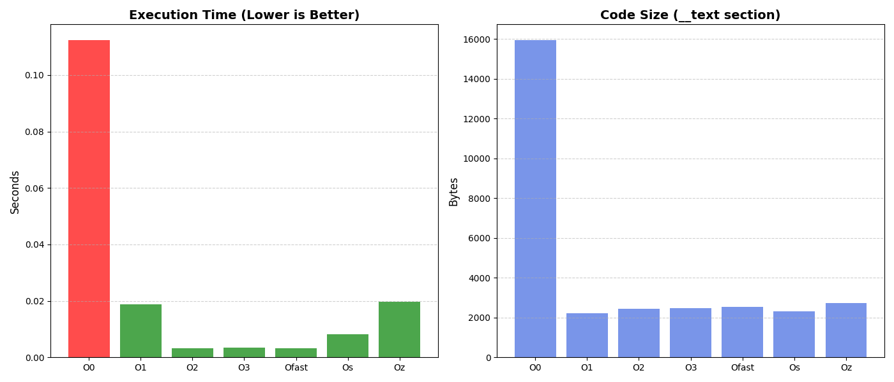

# Compiler Optimization Flags
1. Flags are options passed to the compiler to control the optimization level and behavior during the compilation process.
2. Optimization flags:
    - O0: (no optimization, fast compilation and good for debugging)
    - O1: (some optimization, balances between speed and compilation time)
    - O2: (more optimization, good for production code)
    - O3: (maximum optimization, may increase binary size and compilation time)(also reorders floating point operations which may lead to precision issues)
    - Ofast: (aggressive optimizations that may violate strict standards compliance)
    - Os: (optimize for size, reduces binary size, basically enables all -O2 optimizations that do not increase size)
    - Oz: (optimize for minimum size, even more aggressive than -Os)
    - Og: (optimize for debugging, improves debugging experience)
    
    - Theoritically, Oz or Os can be fatser if they allow more code to fit in cache, but in practice O2 or O3 are often faster due to better overall optimizations (again it's dependent)
3. I ran some benchmarks to compare the size and performance of binaries compiled with different optimization flags. I then ran a bash script to see the size -m results of all the files piped with grep and i/o'ed to a csv file which was then used to generate plots using matplotlib. This is what i got (Code which was compiled was a simple loop to add elements from an array):
    

      
    

    

      
    

    - O0 basically dumbs down the compiler, best for debugging.
    - from my experiments i concluded that sometimes even O2 can outperform O3 in some cases, probably because O3's aggressive optimizations can lead to larger binaries that may not fit well in cache, negating some performance benefits. 
4. Downside of compiler optimizations is that they can mess up debugging, as the optimized code may not correspond directly to the source code. Using gdb with optimizations can overlook errors.
5. GCC and Clang both support these, but both's implementaitions may vary slightly.