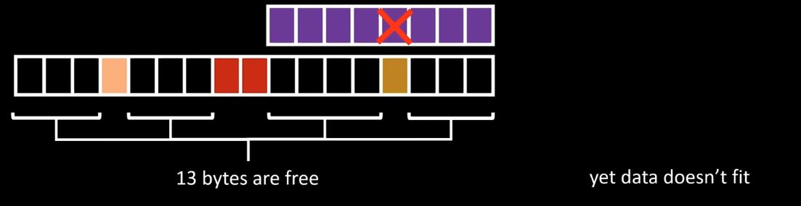
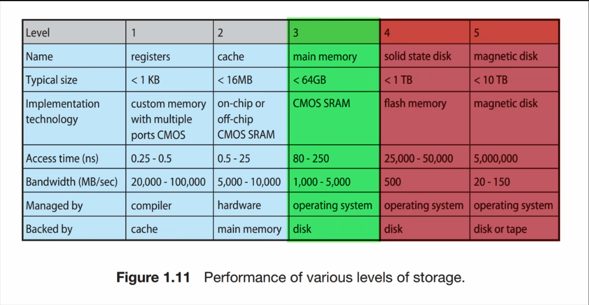
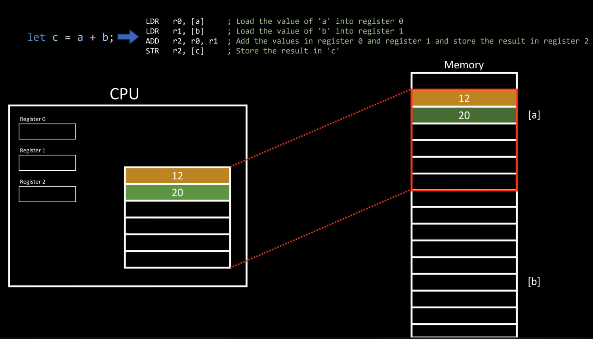
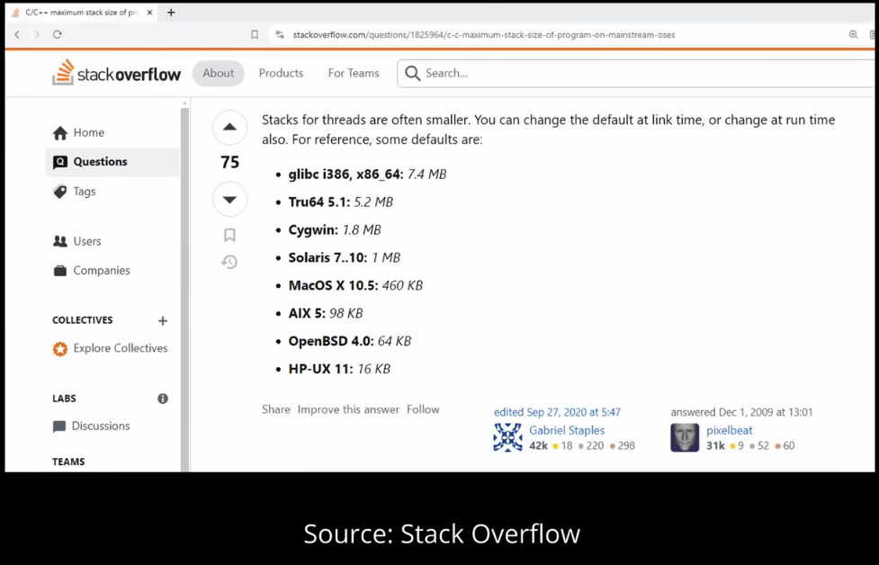
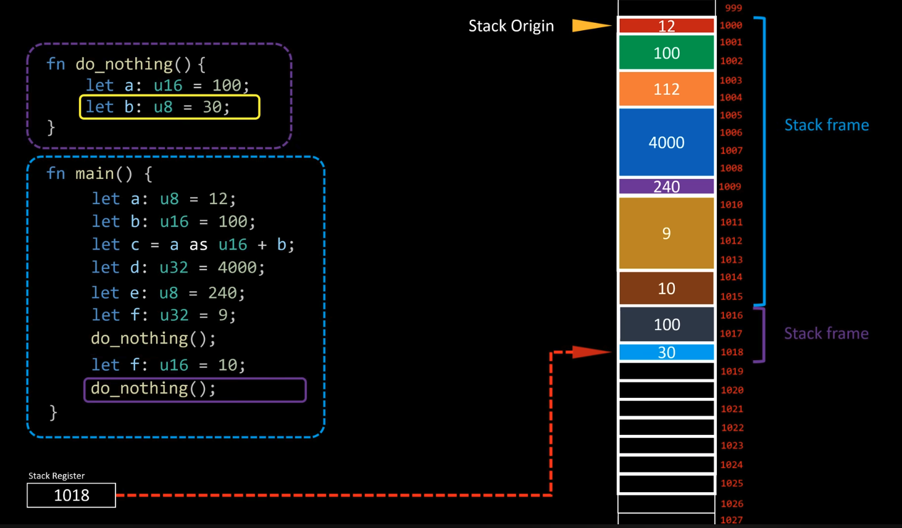

# Why stack is so fast?

1. stack is **aka**: program stack, call stack, execution stack.

2. a program (executable) must ask the OS for memory space. The OS allocates it, but while running, if the program tries to access memory it shouldn’t, the OS terminates it with  **Segmentation Fault (core dumped)**.

3. **external fragmentation**: memory exists, but we still run out of usable space due to bad allocation patterns.  
   

   - requesting more memory takes time; hence using the **heap** gives a performance hit.
   - if main memory (RAM) is exhausted, the OS gives **storage-backed memory** (aka *virtual memory*), but storage is **thousands of times slower** than RAM.  
     
   - even fetching data from main memory has a noticeable cost, hence we have **CPU caches** (different from registers).
   - if data is present in cache → **cache hit**; otherwise → **cache miss** (CPU stalls while data is fetched from main memory).
   - hence keeping data **compact and contiguous** is beneficial to maximize cache hits (this is **locality**: spatial + temporal).  
     

4. the size of the preallocated stack region depends on the **compiler / OS / platform**.  
     
   might seem small, but  
   `1 MB = 1,048,576 bytes → 1,048,576 / 8 = 131,072` 64-bit integers.

5. stack is a contiguous memory region:
   - beginning of stack = **stack origin**
   - the **stack pointer (SP)** keeps track of the top (yes, it usually grows *downwards*).
   - the stack pointer must be stored somewhere → it lives in a **CPU register**.

6. **stack allocation is extremely cheap**:
   - allocation = adjust stack pointer (`SP +=/-= size`)
   - no OS call, no searching for free blocks
   - heap allocation requires OS involvement, metadata, bookkeeping, and fragmentation-handling strategies → slower.

7. when a function is called:
   - a **stack frame** is pushed onto the stack.  
     
   - it contains:
     - local variables
     - function arguments (depending on ABI)
     - saved registers
     - **return address** (return-link)
   - the starting point of the frame must be tracked so that after function completion, the stack pointer can be reset correctly.

8. in **recursion**, if there is no base case:
   - new stack frames keep getting added
   - eventually, the stack runs out of space → **stack overflow**.

9. each **thread has its own stack**:
   - pros: no synchronization needed for local variables
   - cons: fixed size per thread, memory overhead
   - this is one of the reasons shared data structures usually live on the **heap**.
------
[nice video for reference by core dumped](https://youtu.be/N3o5yHYLviQ?si=Rl5FE-83EAskkHWy)